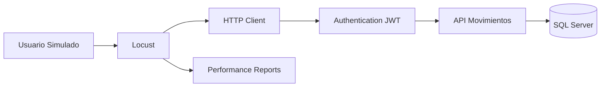
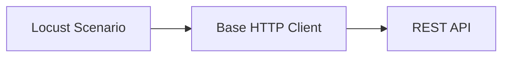
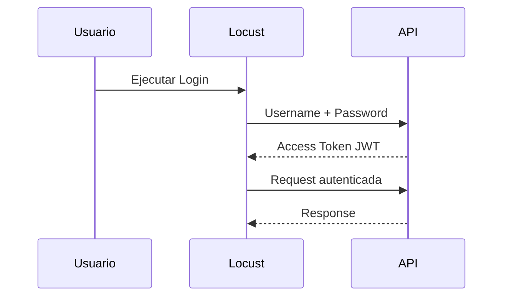
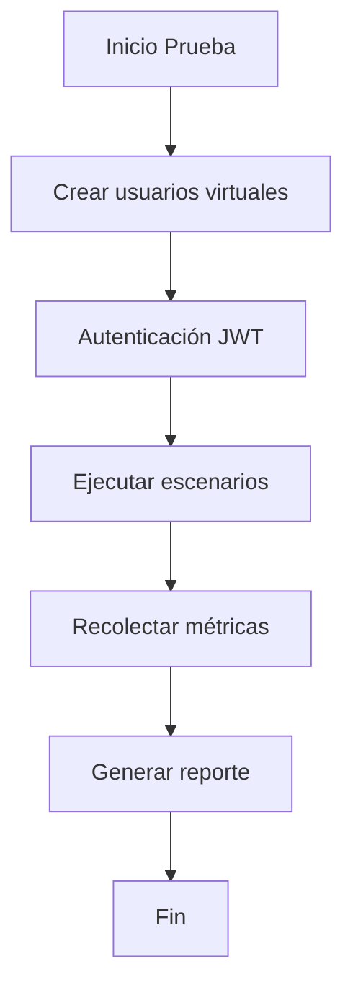
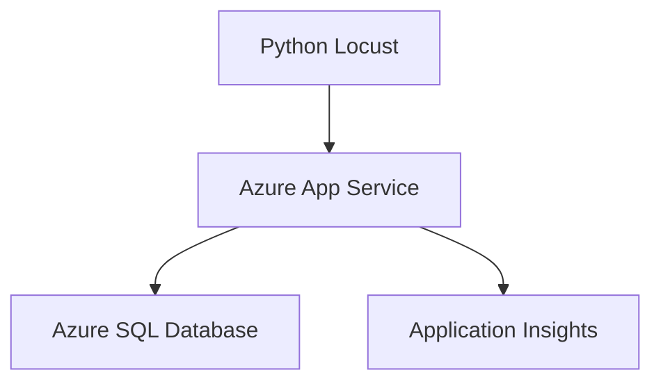

# 🚀 API Movimientos Load Test


Framework de pruebas de carga desarrollado en **Python + Locust** para validar capacidad, rendimiento y comportamiento de la **API Movimientos** bajo escenarios de concurrencia controlada.

El proyecto permite simular usuarios reales consumiendo servicios REST autenticados, medir tiempos de respuesta, detectar errores y obtener métricas necesarias para validar la escalabilidad del backend.

---

# 📌 Objetivo del Proyecto

El objetivo principal es disponer de una herramienta automatizada para ejecutar pruebas de rendimiento sobre la API, permitiendo:

- Simular usuarios concurrentes.
- Ejecutar flujos funcionales completos.
- Validar autenticación JWT.
- Medir tiempos de respuesta.
- Detectar degradación bajo carga.
- Obtener métricas para decisiones de escalamiento.
- Preparar pruebas integradas con ambientes Azure.

---

# 🏗️ Arquitectura



---

# 📂 Estructura del Proyecto

```
LoadTest
│
├── config
│   ├── settings.json
│   └── settings.py
│
├── clients
│   ├── base_client.py
│   └── auth_client.py
│
├── models
│   └── responses.py
│
├── locustfiles
│   └── api_user.py
│
├── reports
│
├── logs
│
├── requirements.txt
│
├── main.py
│
└── README.md
```

---

# 🔧 Tecnologías Utilizadas

| Tecnología | Uso |
|---|---|
| Python 3.12 | Lenguaje principal |
| Locust | Motor de pruebas de carga |
| Requests | Cliente HTTP |
| Pydantic | Modelado de respuestas |
| JSON | Configuración externa |
| JWT | Autenticación API |
| Git | Control de versiones |

---

# 🚦 Evolución del Proyecto

## Sprint 1 - Base del Proyecto Python

### Objetivo

Crear la estructura inicial del framework de pruebas.

### Implementado

✅ Creación proyecto Python.

✅ Configuración ambiente virtual.

✅ Administración de dependencias.

✅ Separación por responsabilidades.

✅ Configuración externa mediante archivos JSON.

Estructura inicial:

```
config/
clients/
models/
locustfiles/
```

Resultado:

Base preparada para incorporar clientes HTTP y escenarios de carga.

---

# Sprint 2 - Cliente HTTP Reutilizable

## Objetivo

Crear una capa común para consumir la API evitando duplicación de código.

### Implementado

Cliente base:

```
clients/base_client.py
```

Responsabilidades:

- Configuración URL base.
- Headers HTTP comunes.
- Ejecución GET / POST.
- Manejo respuestas HTTP.
- Gestión errores.


Arquitectura:



Resultado:

Los escenarios de prueba quedan desacoplados del detalle HTTP.

---

# Sprint 3 - Autenticación JWT

## Objetivo

Simular usuarios reales autenticados contra la API.

### Implementado

Cliente autenticación:

```
clients/auth_client.py
```


Flujo:




Características:

✅ Login API.

✅ Obtención Access Token.

✅ Uso Bearer Authentication.

✅ Modelos de respuesta.

✅ Preparación para Refresh Token.


---

# Sprint 4 - Escenarios de Carga Locust

## Objetivo

Crear usuarios virtuales capaces de ejecutar operaciones reales.

### Implementado

✅ Usuarios simulados.

✅ Tasks de negocio.

✅ Tiempo de espera entre operaciones.

✅ Distribución de carga.

Ejemplo:

```python
class ApiUser(HttpUser):

    wait_time = between(1, 5)

    @task
    def consultar_movimientos(self):
        self.client.get("/api/movimientos")
```

---

## Escenarios Implementados

| Escenario | Objetivo |
|---|---|
| Login | Validar autenticación |
| Consulta movimientos | Validar rendimiento lectura |
| Consultas API | Medir capacidad respuesta |
| Flujo usuario completo | Simular operación real |

---

# Sprint 5 - Ejecución y Métricas

## Objetivo

Preparar pruebas reales de rendimiento.


### Implementado

✅ Ejecución mediante Locust Web UI.

✅ Ejecución headless.

✅ Reportes HTML.

✅ Métricas de rendimiento.

✅ Análisis de errores.


---

# 📊 Métricas Analizadas


| Métrica | Descripción |
|---|---|
| Requests | Cantidad total solicitudes |
| Failures | Solicitudes fallidas |
| Response Time | Tiempo respuesta |
| RPS | Requests por segundo |
| Percentiles | Distribución latencia |
| Usuarios activos | Concurrencia simulada |

---

# ▶️ Instalación


Crear ambiente virtual:

```bash
python -m venv .venv
```


Activar ambiente:

Windows:

```bash
.venv\Scripts\activate
```


Linux:

```bash
source .venv/bin/activate
```


Instalar dependencias:

```bash
pip install -r requirements.txt
```

---

# ▶️ Ejecución de Pruebas


## Modo Web


Ejecutar:

```bash
locust -f locustfiles/api_user.py
```


Abrir:

```
http://localhost:8089
```


---

## Modo Headless


Ejemplo:

```bash
locust \
-f locustfiles/api_user.py \
--users 100 \
--spawn-rate 10 \
--run-time 5m \
--host https://api-url
```

Parámetros:

| Parámetro | Descripción |
|---|---|
| users | Usuarios concurrentes |
| spawn-rate | Usuarios creados por segundo |
| run-time | Duración prueba |
| host | URL API objetivo |

---

# 📈 Flujo de Prueba




---

# ☁️ Preparación Azure


Arquitectura objetivo:




---

# Próximos Pasos


## Sprint 6 - Automatización

Pendiente:

- Integración CI/CD.
- Ejecución automática.
- Comparación contra baseline.
- Reportes históricos.


## Sprint 7 - Pruebas Avanzadas

Pendiente:

- Stress Testing.
- Endurance Testing.
- Spike Testing.
- Validación límites infraestructura.


---

# Estado Actual


🟢 Proyecto Python estructurado.  
🟢 Cliente HTTP implementado.  
🟢 Autenticación JWT integrada.  
🟢 Escenarios Locust configurados.  
🟢 Métricas de rendimiento disponibles.  
🟢 Preparado para pruebas de carga sobre Azure.

---

# Autor

Proyecto desarrollado para pruebas de rendimiento de **API Movimientos**.